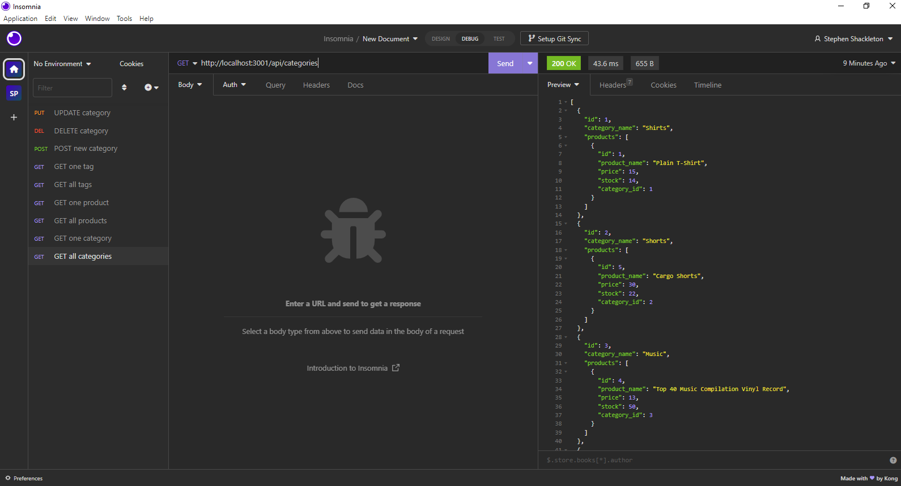

# Week 13 Challenge - ORM Back-end for E-Commerce
## Description
The purpose of this challenge was to create an app that uses object relational models to create the backend of a retail site.
## Dependencies
The user needs to have installed Express.js, Node.js, mySQL, Sequelize, dotENV, and Insomnia
## Running the App
* Log into mySQL from the command line, then run "source db/schema.sql", then exit mySQL
* Next, run "node seeds/index.js" to seed the database
* Last, run "npm start" to begin the locahost, then you can do requests through Insomnia
## Screenshot

## Link to Demo Videos
Terminal Video Link
https://drive.google.com/file/d/1iWBeTQqoT2CcX3LDJoy2HTGlaFa_e-0K/view
Insomnia Video Link
https://drive.google.com/file/d/1SGdWwhqs9L-6_wJM-k2azFVmlqG2kDEh/view